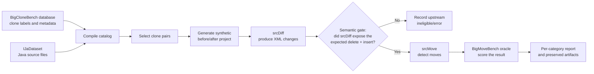

```mermaid
flowchart LR
    A["BigCloneBench database<br/>clone labels and metadata"] --> C["Compile catalog"]
    B["IJaDataset<br/>Java source files"] --> C
    C --> D["Select clone pairs"]
    D --> E["Generate synthetic<br/>before/after project"]
    E --> F["srcDiff<br/>produce XML changes"]
    F --> G{"Semantic gate:<br/>did srcDiff expose the<br/>expected delete + insert?"}
    G -->|No| H["Record upstream<br/>ineligible/error"]
    G -->|Yes| I["srcMove<br/>detect moves"]
    I --> J["BigMoveBench oracle<br/>score the result"]
    J --> K["Per-category report<br/>and preserved artifacts"]
```
