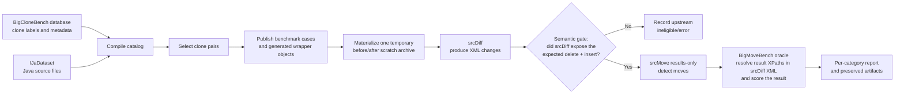

```mermaid
flowchart LR
    A["BigCloneBench database<br/>clone labels and metadata"] --> C["Compile catalog"]
    B["IJaDataset<br/>Java source files"] --> C
    C --> D["Select clone pairs"]
    D --> E["Publish benchmark cases<br/>and generated wrapper objects"]
    E --> F["Materialize one temporary<br/>before/after scratch archive"]
    F --> G["srcDiff<br/>produce XML changes"]
    G --> H{"Semantic gate:<br/>did srcDiff expose the<br/>expected delete + insert?"}
    H -->|No| I["Record upstream<br/>ineligible/error"]
    H -->|Yes| J["srcMove results-only<br/>detect moves"]
    J --> K["BigMoveBench oracle<br/>resolve result XPaths in srcDiff XML<br/>and score the result"]
    K --> L["Per-category report<br/>and preserved artifacts"]
```
