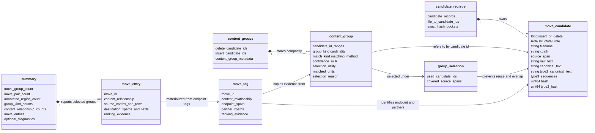

# srcMove data structures

This diagram shows the primary implemented types and the ownership boundary
between candidates, derived matching groups, annotation data, and JSON results.
It intentionally omits short-lived parsing stacks and profiling counters. See
[Architecture](../architecture.md) for behavior and selection semantics.

`candidate_registry` is the authoritative owner of candidates. `content_groups`
is a derived snapshot containing candidate identifiers rather than candidate
copies. FNV-1a hashes index exact and Type-2c representations, but full canonical
text confirms equality. Type-3 candidates are shortlisted by construct kind and
sequence size before bounded-LCS comparison; there is no SHA-1 index,
probability model, or retained AST in the current implementation.
