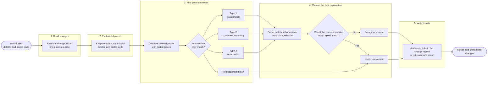

# srcMove algorithm flowcharts

These diagrams describe the implemented srcMove pipeline. The
[architecture](../architecture.md) remains the canonical technical description.
Before publication, verify the figures against the source revision frozen for
the thesis evaluation.

The editable source is Mermaid. Export the final thesis figures to SVG or PDF
so text and lines remain sharp in print.

## Simple overview

This is the recommended main-chapter figure. It presents the algorithm as five
phases and leaves implementation details to the surrounding text.

**Figure 4.1. srcMove pipeline overview.** The five phases transform srcDiff's
deleted and added code into selected move relationships and unmatched changes.

## Detailed decision flow

This figure is suitable for the algorithm section or a landscape appendix. It
uses the same five phases but exposes the important “if this, then that” rules.

```mermaid
flowchart TB
    input([srcDiff XML<br/>deleted and added code])

    subgraph p1 [Phase 1 — Read changes]
        validate[Validate the root and determine whether<br/>the input is one file or an archive]
        enter[Enter the next file in the input]
        event[Read the next XML event<br/>in document order]
        update[Update file and version state;<br/>feed text and structure into every<br/>open region and nested construct]
        closing{Did a deleted or added<br/>region just end?}
        finish[Finish the collected information<br/>for that region]
        moreInput{Is there more<br/>input?}

        validate --> enter --> event --> update --> closing
        closing -- No --> moreInput
        closing -- Yes --> finish
        moreInput -- Yes --> event
    end

    subgraph p2 [Phase 2 — Find useful pieces]
        oldMove{Was this region already<br/>marked as a move?}
        pure{Does it contain only code<br/>from the same version?}
        meaningful{Is it a complete, meaningful<br/>statement or larger construct?}
        keep[Keep it as a possible<br/>deleted or added piece]
        ignore[Ignore this outer region]
        inner[Still keep any useful<br/>code nested inside it]

        oldMove -- Yes --> ignore
        oldMove -- No --> pure
        pure -- No --> ignore
        pure -- Yes --> meaningful
        meaningful -- No --> ignore
        meaningful -- Yes --> keep
        ignore --> inner
    end

    saved[(Saved in memory for matching<br/>deleted or added side<br/>file, span, and XPath<br/>raw source text<br/>Type 1 and Type 2 forms<br/>Type 3 statement and token sequences<br/>structural role)]

    subgraph p3 [Phase 3 — Find possible moves]
        load[Compare an insert and delete]
        same{Is pair Type 1? <br/> Ignore comments and formatting}
        names{Is pair Type 2? <br/> Consistently replace names and literals.}
        close{Is pair Type 3? <br/> At least 90% alike in either statements or tokens?}
        exact[Possible Type 1 move]
        renamed[Possible Type 2 move]
        near[Possible Type 3 move]
        noMatch[No supported match]
        repeated{Does this description match<br/>several deleted or added pieces?}
        group[Keep the supported group;<br/>do not invent individual pairings]
        uniqueNames{Exactly one deleted and<br/>one added piece?}
        unresolved[Leave repeated renamed<br/>pieces unresolved]
        addPossible[Add the supported possibility<br/>to the shared list]
        keepUnmatched[Keep as unmatched evidence]
        moreComparisons{Are there more deleted and<br/>added pieces to compare?}

        load --> same
        same -- Yes --> repeated
        same -- No --> names
        names -- Yes --> uniqueNames
        names -- No --> close
        close -- Yes --> near
        close -- No --> noMatch
        repeated -- Yes --> group
        repeated -- No --> exact
        uniqueNames -- Yes --> renamed
        uniqueNames -- No --> unresolved
        exact --> addPossible
        group --> addPossible
        renamed --> addPossible
        near --> addPossible
        noMatch --> keepUnmatched
        unresolved --> keepUnmatched
        addPossible --> moreComparisons
        keepUnmatched --> moreComparisons
        moreComparisons -- Yes --> same
    end

    subgraph p4 [Phase 4 — Choose the best explanation]
        gather[Put all possible Type 1, Type 2,<br/>and Type 3 matches into one list]
        rank[Rank by match strength and how much<br/>changed code the match explains]
        parent{Do several strong inner matches<br/>explain the change better than one outer match?}
        useChildren[Prefer the inner matches]
        useParent[Keep the outer match available]
        candidate[Consider the highest-ranked<br/>remaining match]
        conflict{Would it reuse a piece or overlap<br/>an already accepted match?}
        skip[Skip it]
        accept[Accept it as a move]
        moreMatches{Are more possible<br/>matches left?}

        gather --> rank --> parent
        parent -- Yes --> useChildren
        parent -- No --> useParent
        useChildren --> candidate
        useParent --> candidate
        candidate --> conflict
        conflict -- Yes --> skip
        conflict -- No --> accept
        skip --> moreMatches
        accept --> moreMatches
        moreMatches -- Yes --> candidate
    end

    subgraph p5 [Phase 5 — Write results]
        outputChoice{Which output<br/>was requested?}
        annotate[Read the input again and<br/>add links between moved code]
        report[Write a results report<br/>without rewriting the input]
        output([Accepted moves and<br/>unmatched changes])

        outputChoice -- Annotated change record --> annotate
        outputChoice -- Results only --> report
        annotate --> output
        report --> output
    end

    input --> validate
    finish --> oldMove
    keep --> saved
    keep --> moreInput
    inner -. any useful nested pieces .-> saved
    inner --> moreInput
    moreInput -- No --> load
    saved -. supplies matching .-> load
    moreComparisons -- No --> gather
    moreMatches -- No --> outputChoice
```

**Figure 4.2. Detailed srcMove decision flow and retained candidate data.**
Phase 1 reads XML events sequentially rather than building and retaining a
srcDiff tree. The datastore at the side shows the information retained after a
candidate has passed Phase 2; temporary parser and open-region state is
discarded as the stream advances.

## Type vocabulary

The figures use the thesis's expected move vocabulary:

- **Type 1** is an exact match after ignoring comments and formatting;
- **Type 2** permits consistent changes to names and literal values;
- **Type 3** is a near match under the 90% sequence-similarity rule;
- **useful piece** is a move candidate;
- **possible move** is a match proposal; and
- **best explanation** is the ranked, non-overlapping selection step.

## Implementation boundaries

- Phases 1–2: `src/region_filter.cpp` and
  `src/parse/canonical_subtree.cpp`
- Phase 3: `src/move_registry/content_group_builder.cpp` and
  `src/move_registry/sequence_similarity.cpp`
- Phase 4: `src/move_registry/selection_policy.cpp` and
  `src/move_registry/group_selection.cpp`
- Phase 5: `src/writer/annotation_writer.cpp` and `src/pipeline.cpp`

The selection score ranks competing explanations; it is not a calibrated
probability that a change is a move.
